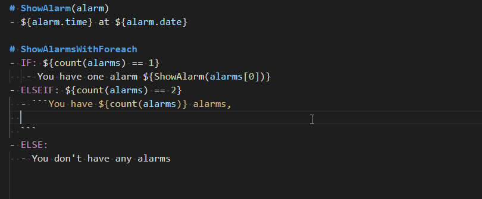

# Bot Framework Adaptive Tool

## Introduction of language server

- Language Servers can be implemented in any language and run in their own process
- They communicate with the code editor through the Language Server Protocol
- Any LSP-compliant language toolings can integrate with multiple LSP-compliant code editors
- Any LSP-compliant code editors can easily pick up multiple LSP-compliant language toolings
- In this way, LSP is a win for both language tooling providers and code editor vendors!
- reference doc: [language server extension](https://code.visualstudio.com/api/language-extensions/language-server-extension-guide)


## Features on Language Server

### Syntax highlighting, diagnostic check, auto-suggest, functionality
#### .lu documents
- syntax highlighting

- diagnostic check

- completion 


#### .lg documents
- syntax highlighting


- diagnostic check


- template reference hover


- builtin function hover


- buildin function and template suggestion


- structure property suggestion


- template definition


<a name="set_up"></a>

## Setting up and using Visual Studio Code to run client and server
### setting up
To configure Visual Studio Code you need to add a target in your launch.settings file.

* **Bot: Launch language server and client on vscode** - Configuration for building and launching your client on vscode and connecting to server
Example is:
```json
        {
			"type": "extensionHost",
			"request": "launch",
			"name": "Launch Client",
			"runtimeExecutable": "${execPath}",
			"args": ["--extensionDevelopmentPath=${workspaceRoot}"],
			"outFiles": ["${workspaceRoot}/client/out/**/*.js"],
			"preLaunchTask": {
				"type": "npm",
				"script": "watch"
			},
			"sourceMaps": true
		},
		{
			"type": "node",
			"request": "attach",
			"name": "Attach to LgServer",
			"port": 6010,
			"restart": true,
			"sourceMaps": true,
			"outFiles": ["${workspaceRoot}/server/out/lg/**/*.js"]
		}
```

### Troubleshooting
There are 2 places your bot can be running depending on the tools you are using.

* **Visual Studio** - Visual studio runs using IIS Express.  IIS Express keeps running even after visual studio shuts down
* **Visual Studio Code** - VS code uses **dotnet run** to run your bot.

If you are switching between environments make sure you are talking to the right instance of your bot.


