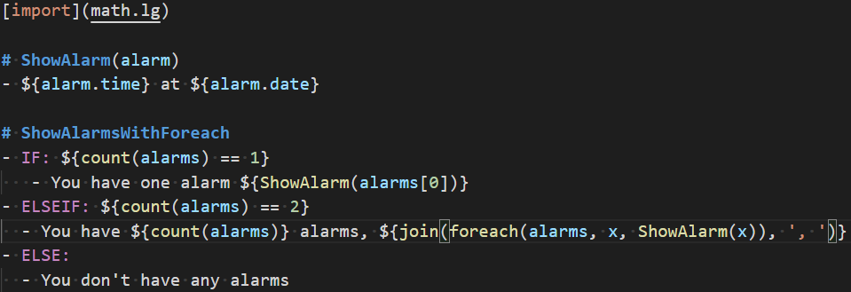
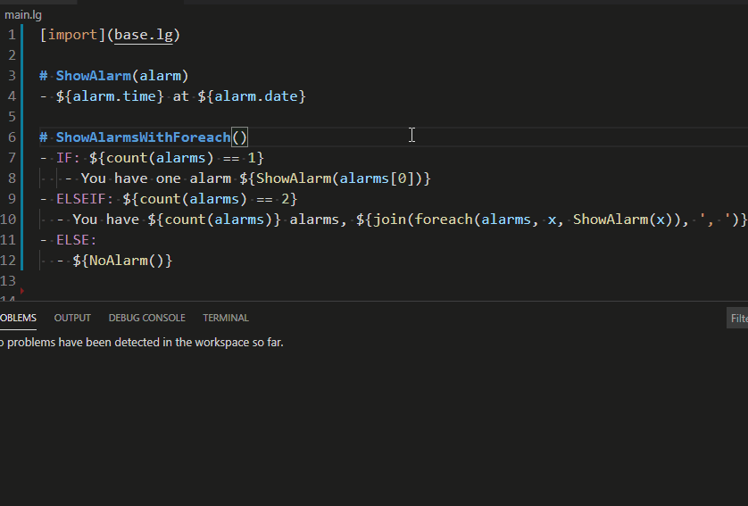
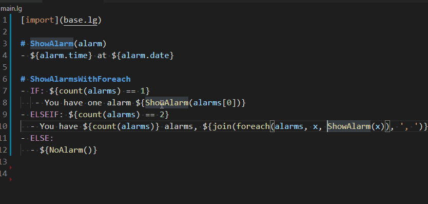
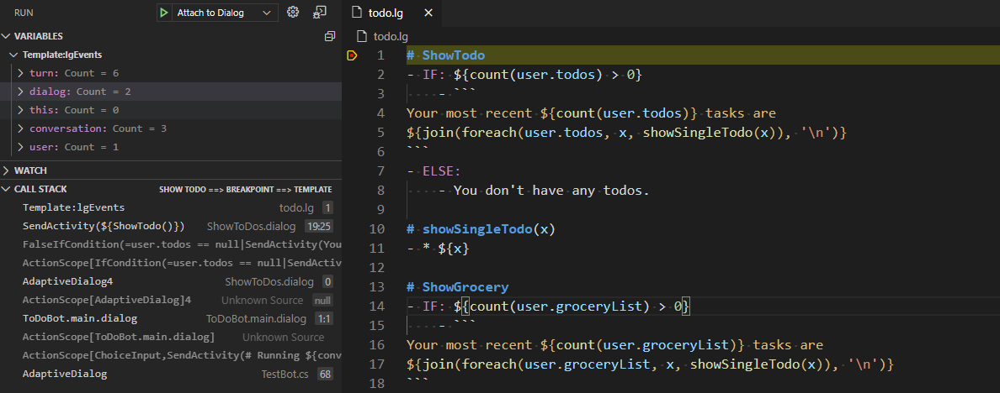

# Bot Framework Adaptive Tool

## Features
### Debug adaptive dialogs
[Setting up](#set_up)

- Supports break points in .dialog files (adaptive dialog)
- Supports break points in .lg files
- Supports break points in adaptive expressions

### Syntax highlighting, diagnostic check, auto-suggest, functionality
#### .lu documents
- syntax highlighting

- diagnostic check

- completion 


#### .lg documents
- syntax highlighting


- diagnostic check


- template reference hover


- builtin function hover


- buildin function and template suggestion


- structure property suggestion


- template definition



### Expansion/ test UI for .lg documents
- template/free text evaluation
Press `F1` and select `LG live tester` to start LG tester.
This tool can be used to test specific template or free inline text.

<a name="set_up"></a>

## Setting up and using Visual Studio Code to use the debugger
### setting up
To configure Visual Studio Code you need to add a target in your launch.settings file.

You can do that by the **add a configuration** in the debug panel.

There should be 2 configuration templates available:

* **Bot: Launch .NET Core Configuration** - Configuration for building and launching your bot via **dotnet run** and connecting to it
Example is:
```json
        {
            "type": "bot",
            "request": "launch",
            "name": "Debug Bot (.NET Core)",
            "command": "dotnet",
            "args": [
                "run",
                "--no-build",
                "--",
                "--debugport",
                "0"
            ]
        }
```
* **Bot: Attach Configuration** - Configuration for attaching to the debug port of an already running bot (such as IIS express)
Example is:
```json
        {
            "type": "bot",
            "request": "attach",
            "name": "Attach to Dialog",
            "debugServer": 4712
        }
```

### Using

* Open any source file (*.dialog, *.lg) and set breakpoints.
* Hit F5 to start debugger.

As you interact with the bot your breakpoint should hit and you should be able to inspect memory, call context, etc.


### Troubleshooting
There are 2 places your bot can be running depending on the tools you are using.

* **Visual Studio** - Visual studio runs using IIS Express.  IIS Express keeps running even after visual studio shuts down
* **Visual Studio Code** - VS code uses **dotnet run** to run your bot.

If you are switching between environments make sure you are talking to the right instance of your bot.


